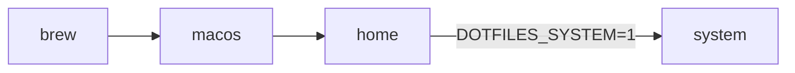

# Dotfiles

Versioned configs under [`home/`](home/) plus scripts that install Homebrew (from [`packages/brew/Brewfile`](packages/brew/Brewfile)), apply macOS defaults, copy or stow those files into `$HOME`, and optionally snapshot machine state with [`export.sh`](export.sh).

## Quick start

`./bootstrap.sh` must run from a **checkout on disk** (it loads `packages/lib.sh` next to the script). Do **not** pipe `bootstrap.sh` straight into `bash` from `curl`.

**Get the repo on disk — pick one:**

Already have the repo (any path):

```bash
cd /path/to/dotfiles && ./bootstrap.sh
```

Clone into `~/dotfiles` (change the path if you want). One variable keeps the GitHub slug in sync:

```bash
DOTFILES_REPO=fjcero/dotfiles
git clone "https://github.com/${DOTFILES_REPO}.git" ~/dotfiles && cd ~/dotfiles && ./bootstrap.sh
```

First-time one-liner: pipe **only** [`first-install.sh`](first-install.sh) (never `bootstrap.sh`). Use the **same** `DOTFILES_REPO` in the `curl` URL and in `env` so the script you download and the tree you clone always match (fork? set `DOTFILES_REPO=you/your-fork` everywhere in that block). Default clone dir is **`~/dotfiles`** (`DOTFILES_CLONE_DIR` to override).

```bash
DOTFILES_REPO=fjcero/dotfiles
curl -fsSL "https://raw.githubusercontent.com/${DOTFILES_REPO}/main/first-install.sh" \
  | env DOTFILES_REPO="$DOTFILES_REPO" bash -s --
```

Non-GitHub or SSH remotes: set **`GIT_REPO_URL`** instead of **`DOTFILES_REPO`** (full clone URL); your `curl` URL should still point at the `first-install.sh` you trust (often the same repo’s raw file).

Piping `bash` trusts TLS and the host; use a pinned branch or tag in the URL if you care.

Optional privileged steps (`sudo`, `hosts` snippets) after you are in the repo:

```bash
DOTFILES_SYSTEM=1 ./bootstrap.sh
```

## What runs



Default order is **brew → macos → home** (see [`packages/lib.sh`](packages/lib.sh)). **`home`** applies `home/` into `$HOME` (rsync by default), fixes `~/.ssh` permissions when present, and may run a quick zinit compile. **system** runs only when **`DOTFILES_SYSTEM=1`**.

## Where things live

- **`home/`** — Files as they should appear under `$HOME` (e.g. `.zshrc`, `.gitconfig`, `.ssh/config`).
- **`packages/brew/Brewfile`** — Brew bundle recipe; not a dotfile in `$HOME`.
- **`packages/*/install`** — Bootstrap steps; **`packages/*/export`** — used by `./export.sh` into `exports/<name>/`.
- **`exports/`** — Output from `./export.sh` (brew inventory, macOS export, and dotfile snapshots from `$HOME` via the `home` export).

## Applying `home/`

By default **`DOTFILES_HOME_MODE`** is **rsync** (real files; `README.md` and `.stow-local-ignore` in `home/` are skipped). Use **`stow`** for symlinks. Set **`DOTFILES_RSYNC_DELETE=1`** only if you intend rsync **`--delete`** on `$HOME` (risky).

## Common environment knobs

- **`DOTFILES_REPO`** — For [`first-install.sh`](first-install.sh): GitHub **`owner/repo`** slug; expands to **`https://github.com/owner/repo.git`**. Use the **same** value in `raw.githubusercontent.com/…/first-install.sh` and in `env` so curl and clone stay aligned. This README uses **`fjcero/dotfiles`** in the examples.
- **`GIT_REPO_URL`** — Full clone URL when **`DOTFILES_REPO`** is not enough (non-`github.com` HTTPS, SSH, etc.). If set, it overrides **`DOTFILES_REPO`**.
- **`DOTFILES_CLONE_DIR`** — Where `first-install.sh` puts the clone (default **`~/dotfiles`**).
- **`DOTFILES_PACKAGES` / `DOTFILES_SKIP`** — Comma lists to allow or skip install steps (skip wins).
- **`DOTFILES_SYSTEM=1`** — Also run `sudo` and `hosts` installs.
- **`DOTFILES_HOME_MODE`**, **`DOTFILES_RSYNC_DELETE`** — See above.

Full list: comments in [`bootstrap.sh`](bootstrap.sh) and [`packages/lib.sh`](packages/lib.sh).

## Commands

```bash
./bootstrap.sh
./export.sh
./export.sh --timestamp
./packages/macos/export --list
```

Personalization (local-only files, git includes, etc.): [`home/README.md`](home/README.md).
