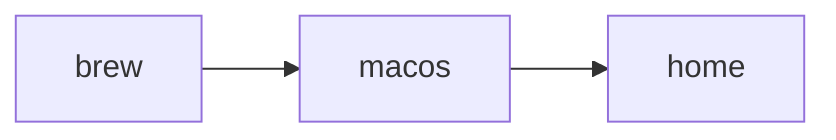

# Dotfiles

Versioned configs under [`home/`](home/) plus [`bootstrap.sh`](bootstrap.sh) (Homebrew from [`packages/brew/Brewfile`](packages/brew/Brewfile), macOS defaults, apply configs to `$HOME`) and [`export.sh`](export.sh) (refresh that Brewfile; snapshot macOS + home under `exports/`).

## Quick start

[`./bootstrap.sh`](bootstrap.sh) must run from a **checkout on disk** (it loads `packages/lib.sh` next to the script). Do **not** pipe `bootstrap.sh` straight into `bash` from `curl`.

**Get the repo on disk — pick one:**

Already have the repo (any path):

```bash
cd /path/to/dotfiles && ./bootstrap.sh
```

Clone into `~/dotfiles` (change the path if you want). One variable keeps the GitHub slug in sync:

```bash
DOTFILES_REPO=fjcero/dotfiles
git clone "https://github.com/${DOTFILES_REPO}.git" ~/dotfiles && cd ~/dotfiles && ./bootstrap.sh
```

First-time one-liner: pipe **only** [`first-install.sh`](first-install.sh) (never `bootstrap.sh`). Use the **same** `DOTFILES_REPO` in the `curl` URL and in `env` so the script you download and the tree you clone always match (fork? set `DOTFILES_REPO=you/your-fork` everywhere in that block). Default clone dir is **`~/dotfiles`** (`DOTFILES_CLONE_DIR` to override).

```bash
DOTFILES_REPO=fjcero/dotfiles
curl -fsSL "https://raw.githubusercontent.com/${DOTFILES_REPO}/main/first-install.sh" \
  | env DOTFILES_REPO="$DOTFILES_REPO" bash -s --
```

Non-GitHub or SSH remotes: set **`GIT_REPO_URL`** instead of **`DOTFILES_REPO`** (full clone URL); your `curl` URL should still point at the `first-install.sh` you trust (often the same repo’s raw file).

Piping `bash` trusts TLS and the host; use a pinned branch or tag in the URL if you care.

Privileged **`sudo`** / **`hosts`** installs are **not** part of **`./bootstrap.sh`**; run them from a separate script (e.g. **`sudo ./packages/sudo/install`** after reviewing it), or source **`packages/lib.sh`** and call **`dotfiles_install_package sudo`** or **`dotfiles_install_package hosts`** when you control allow/skip lists yourself.

## What runs



**`./bootstrap.sh`** runs **`brew` → `macos` → `home`** in that order (three **`dotfiles_install_package`** calls in [`bootstrap.sh`](bootstrap.sh); helper in [`packages/lib.sh`](packages/lib.sh)). **`home`** applies `home/` into `$HOME` (rsync by default), fixes `~/.ssh` permissions when present, and may run a quick zinit compile.

## Where things live

- **`home/`** — Files as they should appear under `$HOME` (e.g. `.zshrc`, `.gitconfig`, `.ssh/config`).
- **`packages/lib.sh`** — Shared shell helpers: **`dotfiles_install_package`**, **`dotfiles_run_exports`**, **`dotfiles_apply_home`**, Brew helpers, allow/skip lists.
- **`packages/<name>/`** — One directory per concern: executable **`install`** (and optional **`export`**) plus any small data files (e.g. **`brew/Brewfile`**, **`macos/configs`**). **`bootstrap.sh`** runs **`brew`**, **`macos`**, **`home`** in order; **`export.sh`** runs **`brew`**, **`macos`**, **`home`** exports by default. **`packages/sudo/`** and **`packages/hosts/`** exist for optional manual or scripted use (not invoked by **`./bootstrap.sh`**).
- **`exports/`** — Output from **`./export.sh`** for **macOS** and **home** snapshots (defaults dump, copies from `$HOME`). The **brew** export updates **[`packages/brew/Brewfile`](packages/brew/Brewfile)** in the repo (not under **`exports/`**).

## Applying `home/`

By default **`DOTFILES_HOME_MODE`** is **rsync** (real files; `README.md` and `.stow-local-ignore` in `home/` are skipped). Use **`stow`** for symlinks. Set **`DOTFILES_RSYNC_DELETE=1`** only if you intend rsync **`--delete`** on `$HOME` (risky).

## Common environment knobs

- **`DOTFILES_REPO`** — For [`first-install.sh`](first-install.sh): GitHub **`owner/repo`** slug; expands to **`https://github.com/owner/repo.git`**. Use the **same** value in `raw.githubusercontent.com/…/first-install.sh` and in `env` so curl and clone stay aligned. This README uses **`fjcero/dotfiles`** in the examples.
- **`GIT_REPO_URL`** — Full clone URL when **`DOTFILES_REPO`** is not enough (non-`github.com` HTTPS, SSH, etc.). If set, it overrides **`DOTFILES_REPO`**.
- **`DOTFILES_CLONE_DIR`** — Where `first-install.sh` puts the clone (default **`~/dotfiles`**).
- **`DOTFILES_PACKAGES` / `DOTFILES_SKIP`** — Comma lists to allow or skip install steps (skip wins).
- **`DOTFILES_HOME_MODE`**, **`DOTFILES_RSYNC_DELETE`** — See above.

Full list: comments in [`bootstrap.sh`](bootstrap.sh) and [`packages/lib.sh`](packages/lib.sh).

## Commands

| Command                          | Purpose                                                                                                          |
| -------------------------------- | ---------------------------------------------------------------------------------------------------------------- |
| `./bootstrap.sh`                 | Homebrew + Brewfile, macOS defaults, then apply `home/` into `$HOME`.                                            |
| `./export.sh`                    | Refresh **`packages/brew/Brewfile`** via **`brew bundle dump`**; write **macOS** + **home** exports under **`exports/`**. |
| `./export.sh --timestamp`        | Same, but macOS/home go under **`exports/<YYYYmmdd-HHMMSS>/`** (brew still updates **`packages/brew/Brewfile`** only).        |
| `./packages/macos/export --list` | List `defaults` domains/keys from [`packages/macos/configs`](packages/macos/configs) (read-only; no export dir). |

Personalization (local-only files, git includes, etc.): [`home/README.md`](home/README.md).
